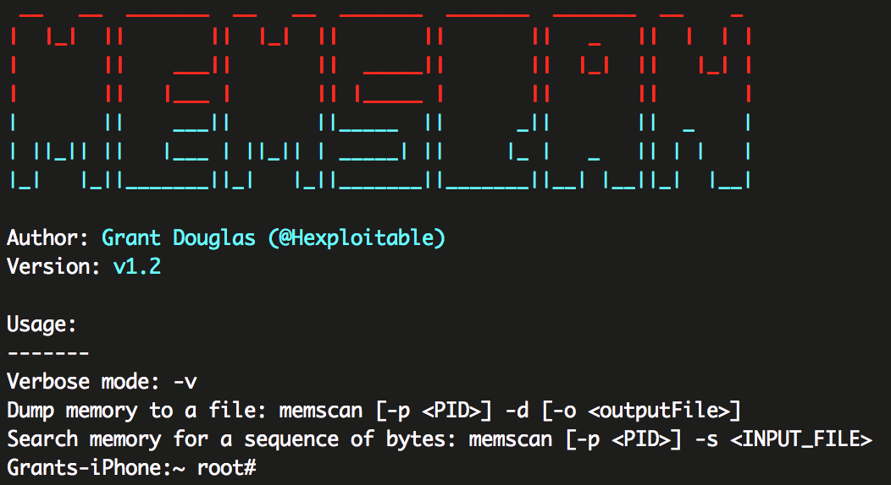

#MEMSCAN

As far as the scanner is concerned, I'm finished with it. I'm going to do a final sweep and remove superfluous code and then I'll land the final commit.

Tweet me: `@Hexploitable`

##Building MEMSCAN
To build MEMSCAN, you will need to have theos installed. Well, you don't really need it but it makes life easier.

Once Theos is installed, simply navigate to the MEMSCAN folder in terminal and run:  
`make package install`

##Usage
###Dumping the memory of a process
1. Obtain the target process PID, using `ps`.
2. Provide the PID to memscan: 
`./memscan -p <PID> -d`

###Finding objects in memory

1. Open your target app or process in a disassembler, grab first ~16 bytes (customise this number as you will) of the method you want to hook and these bytes will be your "signature".

2. Write the signature to a file, make sure to encode the bytes like so:

	`echo -n -e '\x55\x48\x89\xE5\xB8\x15\x00\x00\x00\x5D' > needle`

3. Run the scanner against the target process. It will locate the signature in memory and print it's address. The signature has to be passed in as bytes, not a literal string so use the scanner as shown:

	`./memscan -p <pid> -s <Path to file containing needle>`
  
e.g:

	`./memscan -p 1234 -s ./needle`

4. MEMSCAN should then print the address where the needle is located in memory.

##Resources
There are some fantastic resources out there which can help you develop similar concepts or to improve on this utility.
 
The most useful resource was a book called "Mac OS X Internals: A Systems Approach" which even provides sample code snippets to help you.
 
 
It's been brought to my attention there is another stack of tools which does similar things, called [Radare](https://github.com/radare/radare2), which you should check out as it's pretty cool.

##Contact
For any issues or concerns, contact me on Twitter: `@Hexploitable`.
 
If you need more than 140 characters, open an issue here.
